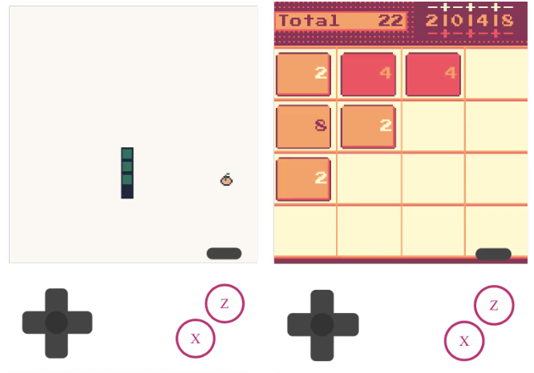
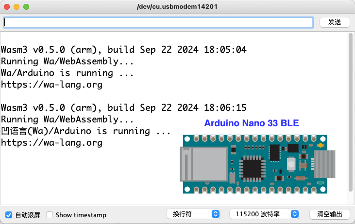

<div align="center">
<h1>The Wa Programming Language</h1>

[简体中文](https://github.com/wa-lang/wa/blob/master/README-zh.md) | [English](https://github.com/wa-lang/wa/blob/master/README.md) 


</div>
<div align="center">

[](https://github.com/wa-lang/wa/actions/workflows/wa.yml)
[](https://coveralls.io/github/wa-lang/wa)
[](https://github.com/wa-lang/wa/releases)
[](https://github.com/wa-lang/wa/blob/master/LICENSE)
[](https://landscape.cncf.io/?item=wasm--languages--wa-lang)

</div>

Wa-lang is a general-purpose programming language designed for for WebAssembly. The goal is to provide a simple, reliable, easy-to-use, statically typed language for high-performance web applications. The back-end code generator and runtime are fully independently developed (not dependent on external projects such as LLVM). Currently, Wa-lang is in the engineering trial stage.


- Home: [https://wa-lang.github.io/](https://wa-lang.github.io/)
- Manual: [https://wa-lang.github.io/man/en/](https://wa-lang.github.io/man/en/)
- Github: [https://github.com/wa-lang/wa](https://github.com/wa-lang/wa)
- Playground: [https://wa-lang.org/playground](https://wa-lang.org/playground)

> Note: Unless otherwise noted, the Wa source files are distributed under the AGPL-v3 license found in the LICENSE file.

## How to contribute
The project is still in the prototype stage. If you have co-construction or PR needs, please refer to [How to contribute](./wca/readme_en.md). We no longer accept PRs for modifications to third-party libraries.

> Note: Submitting a PR to this repository is deemed to be your recognition and acceptance of the [Wa-lang Contributor Agreement](./wca/wca.md)(Aka WCA), but your PRs will not be reviewed or accepted until WCA is actually signed.

## Playground

[https://wa-lang.org/playground](https://wa-lang.org/playground)


## Snake Game

- Play: [https://wa-lang.org/wa/snake/](https://wa-lang.org/wa/snake/)
- Code: [waroot/examples/snake/README-en.md](waroot/examples/snake/README-en.md)


## WASM4 Game

- Wasm4/Snake: https://wa-lang.org/wa/w4-snake/
- Wasm4/2048: https://wa-lang.org/wa/w4-2048/



- [Wasm4/Snake Code](waroot/examples/w4-snake)
- [Wasm4/2048 Code](waroot/examples/w4-2048)

## NES emulator

- Play: [https://wa-lang.org/nes/](https://wa-lang.org/nes/)
- Code: [https://github.com/wa-lang/nes](https://github.com/wa-lang/nes)


## WebGPU Demo

- Play: [https://wa-lang.org/webgpu/](https://wa-lang.org/webgpu/)
- Code: [https://github.com/wa-lang/webgpu](https://github.com/wa-lang/webgpu)


## P5 for creative coding

- https://wa-lang.org/smalltalk/st0037.html


## Arduino Nano 33

- https://wa-lang.org/smalltalk/st0052.html



## Example: Print Wa

Print rune and call function：

```wa
import "fmt"

global year: i32 = 2023

func main {
	println("hello, Wa!")
	println(add(40, 2), year)

	fmt.Println(1+1)
}

func add(a: i32, b: i32) => i32 {
	return a+b
}
```

Execute the program:

```
$ wa run hello.wa 
hello, Wa!
42 2023
2
```

## Example: Print Prime

Print prime numbers up to 30:

```wa
func main {
	for n := 2; n <= 30; n = n + 1 {
		isPrime: int = 1
		for i := 2; i*i <= n; i = i + 1 {
			if x := n % i; x == 0 {
				isPrime = 0
			}
		}
		if isPrime != 0 {
			println(n)
		}
	}
}
```

Execute the program:

```
$ cd waroot && wa run -target=wasi examples/prime
2
3
5
7
11
13
17
19
23
29
```

## Example: Print Prime with Chinese syntax

Print prime numbers up to 30:

```wz
引于 "书"

【启】：
  // 输出30以内的素数
  从n=2，到n>30，有n++：
    设素=1
    从i=2，到i*i>n，有i++：
      设x=n%i
      若x==0则：
        素=0
      。
    。
    若素!=0则：
      书·曰：n
    。
  。
。
```

Output is the same as the previous example.

## Example: Chrome Native AI

Chrome builtin Gemini Nano Demo:

```wa
import "ai"

func main {
	ai.RequestSession(func(session: ai.Session){
		session.PromptAsync("Who are you?", func(res: string) {
			println(res)
		})
	})
}
```

More examples [waroot/examples](waroot/examples)

## Contributors

|Contributor|Contribution points|
| --- | --- |
|柴树杉| 69000|
|丁尔男| 73500|
|史斌  | 29000|
|扈梦明| 39000|
|赵普明| 18000|
|宋汝阳|  2000|
|刘云峰|  1000|
|王湘南|  1000|
|王泽龙|  1000|
|吴烜  |  3000|
|刘斌  |  2500|
|尹贻浩|  2000|
|安博超 | 3000|
|yuqiaoyu| 600|
|qstesiro| 200|
|small_broken_gong|100|
|tk103331|100|
|蔡兴|3000|
|王仁义|1000|
|imalasong|1000|

## Give a Star! ⭐

If you like or are using Wa to learn or start your projects,
please give it a star. Thanks!
